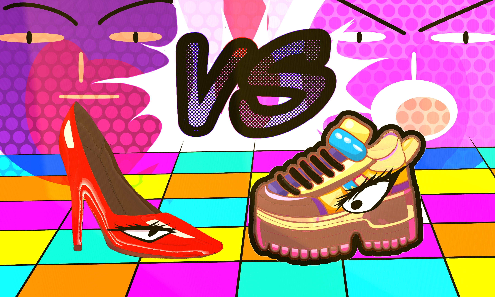
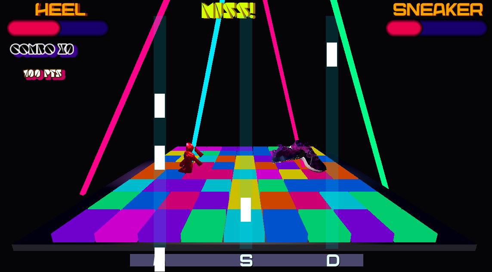
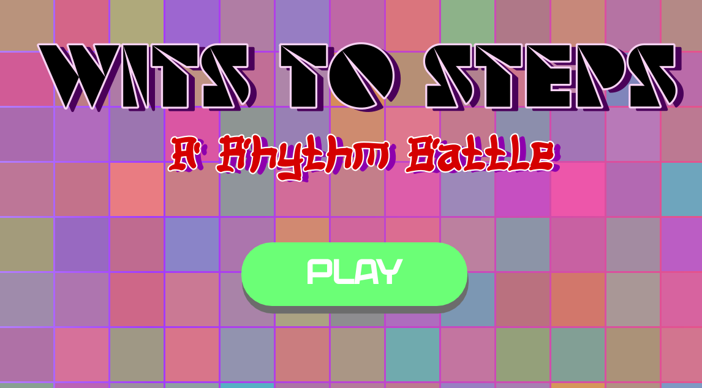

# 👠 Wits to Steps 👟

**Wits to Steps** is a 3D rhythm battle game built in **Godot 4**, where **Heels and Sneakers settle their rivalry on the dance floor!**

Hit notes to the beat, build your combo, earn points, and outperform your opponent before the music ends.

## Play the Game

**[▶ Play Wits to Steps on itch.io](https://tntnoor.itch.io/wits-to-steps)**

##  How to Play

Notes fall down three different lanes.

| Key | Lane |
| --- | --- |
| **A** | Left |
| **S** | Middle |
| **D** | Right |

Hit the notes at the right time to get a **PERFECT!**

Chain PERFECT hits to build your **combo** and increase your score. Missing a note resets your combo.

## Features

- Beat-synchronized rhythm gameplay
- Three-lane **A / S / D** input system
- Consecutive-hit combo system
- Points and performance tracking
- AI-controlled Sneaker opponent
-  Heel vs. Sneaker 3D dance battle
- Two rhythm battle levels
- Animated disco environment
- Color-changing dance floor
- Dynamic neon lights and lasers
- Winner and loser battle animations
- Playable directly in the browser through itch.io

## 📸 Gameplay

## The Battle

The player controls **Heel** and competes against **Sneaker** in a rhythm battle.

Notes spawn according to the music's BPM and travel toward the hit line. Correctly timed inputs increase the player's score and combo while missed notes reset the combo.

Meanwhile, Sneaker acts as an AI-controlled opponent and builds its own battle progress.

At the end of each battle, the scores are compared and the winner takes the dance floor!

## 🛠️ Built With

- **Godot 4**
- **GDScript**
- **3D Assets**
- Godot AnimationPlayer
- Godot UI / Control system
- HTML5/Web export for itch.io

## Development

**Wits to Steps** was created as a game jam project based around a playful **Heel vs. Sneaker** interpretation of the theme **“Head Over Heels.”**

The project combines rhythm mechanics with a colorful 3D nightclub environment. I developed systems for BPM-based note spawning, timing-based inputs, combos, scoring, an AI opponent, multiple levels, character animations, and dynamic environmental effects.

##  Developer

Created by **Taqwa Tasneem**

Built with **Godot 4**.
